<!-- ANIMATED HEADER SVG — commit header.svg to your profile repo -->
<p align="center">
  
</p>

<!-- TYPING ANIMATION -->
<p align="center">
  
</p>

<!-- QUICK BADGES -->
<p align="center">
  
  
  
  
  
</p>

<br/>

---

## ✦ About Me

```yaml
name       : Nikesh
role       : Backend Developer
focus      : [ REST API Design, Database Architecture, Server Optimization ]
building   : [ Real-World Backend Projects, React.js ]
interests  : [ Microservices, Auth & Security, API Performance ]
motto      : "Architect first. Code second. Ship always."
```

---

## ✦ Tech Stack

<p align="center">
  
</p>

<p align="center">
  
  
  
  
  
  
  
  
</p>

---

## ✦ Connect With Me

<p align="center">
  <a href="https://www.linkedin.com/in/nikesh--s/">
    
  </a>
  &nbsp;
  <a href="mailto:nikesh06042004@gmail.com">
    
  </a>
  &nbsp;
  <a href="https://www.instagram.com/nikesh__jr">
    
  </a>
</p>

<br/>

---

<br/>

<p align="center">
  <em>"The best systems aren't built by those who write the most code —<br/>but by those who understand the problem deepest."</em>
</p>

<p align="center">— Nikesh &nbsp;·&nbsp; Backend Developer</p>

<br/>

<!-- FOOTER -->
<p align="center">
  
</p>
